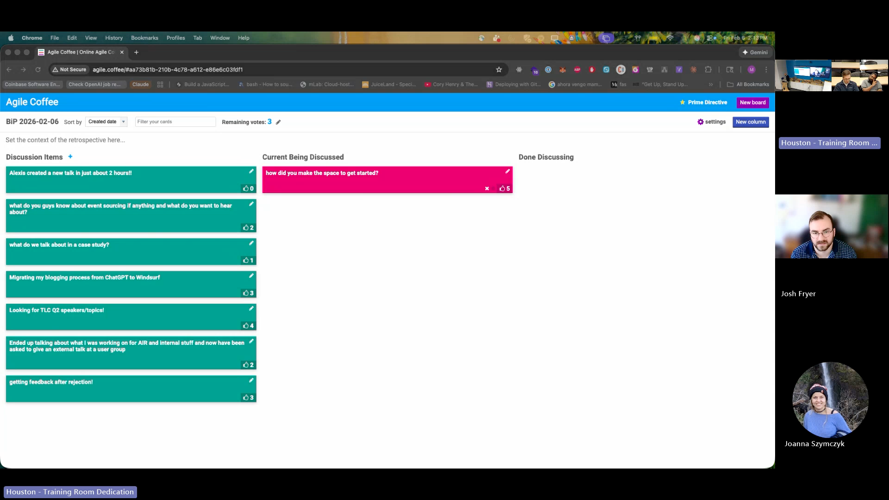
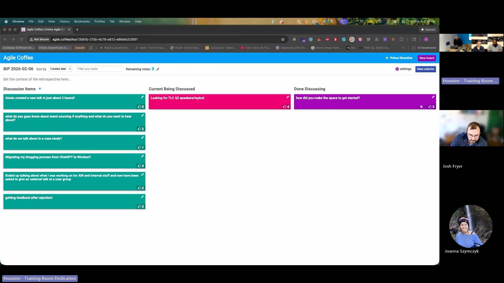
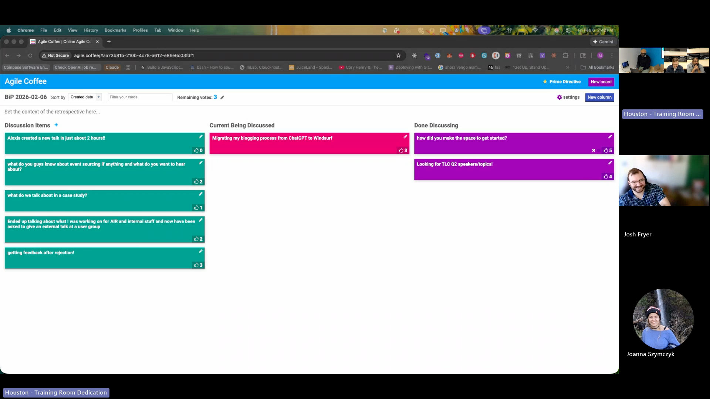
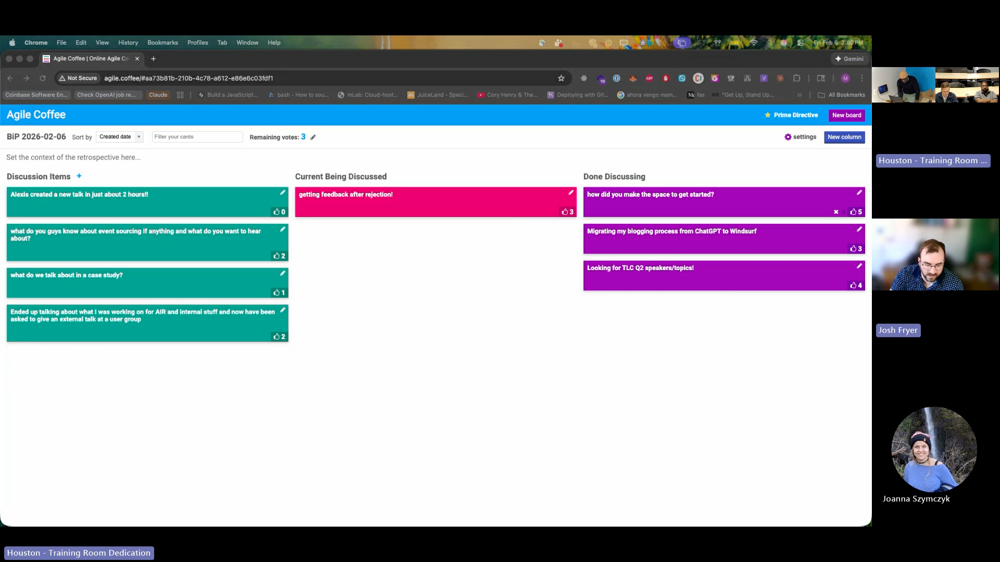
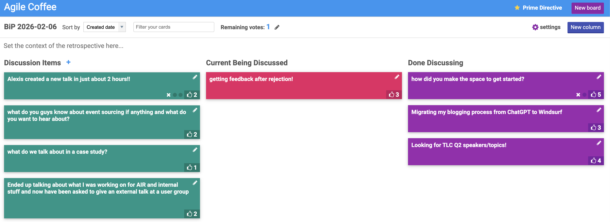

# BiP Session Summary — 2026-02-06

## Session Overview

- **Duration**: ~51 minutes
- **Facilitator**: Matthew Wright
- **Participants**: Matthew, Claudio, Terrence, Jonathan, Josh Fryer (remote from San Antonio), Joanna Szymczyk, Alexis

> **Note on attribution**: This was a hybrid meeting with a shared conference room microphone. Speaker identification was assisted by Deepgram diarization. Some brief contributions may not be attributed.

*The agile.coffee board at session start, with "how did you make the space to get started?" as the first topic under discussion.*

---

## Topics Discussed

### 1. How Did You Make the Space to Get Started? (5 votes)

**Raised by**: Josh Fryer

Josh opened by asking the group a practical question: for those who are publishing and creating content, how did you make the space to get started, and how do you protect that space now? He described himself as someone who does a lot of thinking—while milking goats, cutting trees, driving—but struggles to convert that into a creation habit. "A fledgling fire is easy to smother."

**Responses:**

- **Terrence**: Before tech, he worked hospitality/retail with odd hours. He'd write during quiet windows—noon before a 2 PM shift, or late at night after kids were asleep. He's been working on daily journaling with Claudio's help, blocking time on his calendar and setting phone reminders.

- **Matthew**: Shared his voice journaling process—phone on the dashboard during his 17-mile commute, hit record, just talk. Then transcribe later using the iPhone's built-in recorder, paste into ChatGPT, and extract insights or draft a blog post. He described the fear of the blank page and how he brought the problem to Claudio, who told him "I never face a blank page." Claudio showed him his Obsidian process—peppering notes throughout the day so he's never starting from zero. The social pressure of BiP has been a motivator: "People are always asking me what I'm working on. The more I say nothing, the more anxiety I feel. So I started doing things."

- **Claudio**: Recommended _The Artist's Way_ and its two practices: daily journaling (getting ideas out imperfectly) and blocking 2 hours a week for creative "playtime." He's been tracking creation time vs. consumption time for the past year and a half to ensure he's creating more than consuming. Shared his own origin story—translating technical questions from the Brazilian FoxPro community into English forums, which let him practice English and learn the technology simultaneously.

- **Jonathan**: Carries a digital voice recorder, though recently shifted to using his phone with a home screen widget for quick access. His phone syncs recordings automatically to his computer. Mentioned Daniel's Plaud device (PLAUD AI)—a dedicated recorder tied to an app that generates transcriptions, summaries, and shareable notes.

- **Alexis**: Found a workflow through Obsidian with a quick keyboard shortcut (via Alfred, which Claudio introduced him to) that lets him drop a note into his daily Obsidian file instantly. Helps capture ideas without the friction of voice recording, which he also doesn't prefer.

- **Joanna Szymczyk**: Prefers writing things down but time constraints push her toward voice recording, which she finds uncomfortable. She described the anxiety of using AI conversation mode while recording—the AI interrupts her mid-thought, asks questions, and creates pressure that causes her to rush and make mistakes. "It seems like a little thing, but it's always in the back of my mind."

- **Claudio (follow-up)**: Agreed—he stopped using ChatGPT's conversation mode for the same reason. Now he records his full thoughts first, then engages AI separately. "I want to finish my thoughts." His advice: keep it simple. Just say it out loud and record. Don't overthink the tools.

- **Terrence**: Offered a different perspective as a visual learner—he jots down notes on paper or in his phone. Pocket notebooks, quick 2-minute notes throughout the day. "A piece of paper costs ten cents."

**Key Insight**: There's no single right way to capture ideas—voice recording, written notes, drawings—the important thing is to start, find what works for your learning style, and build the habit. The group consensus: don't wait for the perfect tool. Capture your thoughts however you can, then process them later.

---

### 2. Looking for TLC Q2 Speakers/Topics! (4 votes)

*"Looking for TLC Q2 speakers/topics" moves to Current Being Discussed.*

**Raised by**: Claudio

Claudio announced that Q1 for The Learning Circle (TLC, formerly Tech Fridays) is fully booked and he's already looking ahead to Q2. He explained TLC to Josh: a bi-weekly gathering at Improving Houston (running 10+ years) where someone presents a talk. It's not limited to technical topics—it's "a place for us to learn together."

**Discussion:**

- **Alexander Reeves** already has the first April date. **Terrence** wants a date in April.
- Claudio put **Matthew** and **Jonathan** on notice for Q2 talks.
- Josh asked what TLC is, and Claudio gave the history—originally "Tech Fridays," renamed to reflect its broader scope.
- **Matthew**: Giving a talk tomorrow at The ION on "Agile and AI" to 6th-12th graders. "I want to show them everything that's possible using AI. We're going to be leading with our imagination."
- The group discussed encouraging non-developers (like Jeannie and Mike) to present—especially relevant given the new "Go Up Goes Together" directive for marketing and sales platform work.

---

### 3. Migrating My Blogging Process from ChatGPT to Windsurf (3 votes)

*Claudio's blogging migration topic in the hot seat, with two items already in Done Discussing.*

**Raised by**: Claudio

Claudio described his blogging workflow evolution. Previously, he used ChatGPT's projects feature: voice journal into one project, then move blog-worthy ideas into a dedicated blogging project with custom instructions for his tone, voice, and style. He'd draft in canvas mode, refine, and publish.

Now he's migrating to Windsurf/Cursor, where he creates markdown-based workflow rules. Benefits:

- **Better grounding**: The AI stays constrained to his actual content instead of drifting. With ChatGPT, it would sometimes generate content he never said.
- **Taxonomy enforcement**: His workflow now auto-assigns categories and tags per his personal taxonomy—something ChatGPT's memory feature consistently failed at. "I'd say 'suggest the tags' and the list that came back—nope, those are not in my taxonomy."
- **End-to-end automation**: Draft → assign categories/tags → upload to WordPress, all from the same workspace.
- **Daily posting experiment**: He's been posting every single day in 2026 as an experiment. "With a good process, it's not taking me that much time. I drive home, voice journal, get home, draft the post—it's ready."

**Joanna** shared her experience with ChatGPT's memory feature being unreliable—she'd explicitly ask it to save important information (book titles, quotes), but when trying to retrieve them later, it couldn't find everything. "No matter what I did, it wouldn't pull it up."

**Claudio's next bottleneck**: Consistent image generation. His blog images are "all over the place"—no cohesive color palette or style. He wants a recognizable visual identity. "You see that image, you know it came from my blog."

**Key Insight**: Moving from ChatGPT to an IDE-based workflow (Windsurf/Cursor) with markdown rules files offers more control, better grounding in source material, and a more reliable automated pipeline. The theory of constraints applies: once one bottleneck is solved, attention shifts to the next.

---

### 4. Getting Feedback After Rejection! (3 votes)

*Final topic of the day — "getting feedback after rejection" — with three items completed.*

**Raised by**: Josh Fryer

Josh shared his experience submitting conference proposals in the fall and receiving rejection notices. When he saw others posting LinkedIn announcements about speaking at the Global Scrum Gathering, he went looking for his own status and found a rejection email.

**The key move**: The email said "if you'd like feedback, email this person." Josh had heard from other conference organizers that they often have reviewer feedback but no one ever asks for it. He sent the email—and within three business hours, received eight feedback points across two talks from multiple independent reviewers.

**Feedback highlights:**

- One talk was described as a really interesting topic that would work better as a 15-20 minute lightning talk rather than a 60-minute session. Three independent reviewers said the same thing without seeing each other's comments.
- Other feedback: "Your title's too long."
- Some reviewers remember seeing re-submitted proposals that haven't changed based on previous feedback—and reject them again.

**Claudio**: Pointed out this was a "rejection" only from that specific venue. The idea is still validated—multiple reviewers confirmed it's a good lightning talk. He offered Josh a TLC date to practice the talk. "When are we gonna hear about it?"

**Terrence**: Noted the disconnect—if conferences are willing to give feedback, they should proactively offer it in rejection emails, not wait for people to ask. Many submitters will never ask because the terse rejection email doesn't invite it.

**Josh's talk topic**: "Scheduling conflicts, protecting focused time, and building trust with calendar clarity" (title needs tightening per reviewer feedback).

The group also discussed the conference submission process: title + abstract is standard, some require speaker bios or video samples, format selection (lightning talk vs. full session vs. workshop). Josh described using Gemini to help format proposals to specific conference requirements—feeding in the requirements page and his draft idea.

**Key Insight**: Always ask for feedback after a conference rejection. The feedback often exists but isn't proactively shared. Even a rejection can validate your idea and redirect you to the right format or venue.

---

## Session Wrap-Up

Matthew noted the time and asked the group how to handle undiscussed board items. Claudio suggested carrying items forward as usual—people can re-add them next week if they're still relevant. The group agreed this has been working well.

---

## Key Themes & Insights

1. **Capture first, process later**—whether voice recording, written notes, or quick digital captures, the barrier to creation drops dramatically when you separate capturing ideas from refining them.

2. **Tools are implementation detail**—the group explored voice recorders, phone apps, Obsidian, AI transcription, pen and paper. The consensus: don't overthink the tool. The practice matters more than the platform.

3. **Social accountability drives creation**—multiple participants cited BiP, TLC, and peer relationships as the pressure that gets them creating. Josh's "fledgling fire" metaphor resonated.

4. **AI workflows are migrating from chat to IDE**—Claudio's shift from ChatGPT projects to Windsurf/Cursor with markdown rules represents a broader trend toward more controlled, grounded AI-assisted workflows.

5. **Rejection is redirection**—Josh's conference feedback story demonstrated that rejection often contains validation. The talk wasn't bad—it was the wrong format for the wrong venue.

6. **Track what matters**—Claudio's practice of tracking creation time vs. consumption time gave him confidence that he's producing enough without needing to block dedicated creation time.

---

## Next Week's Potential Follow-ups

- Josh Fryer's lightning talk on calendar clarity and focused time (TLC opportunity)
- Claudio's daily blogging experiment results
- Jonathan's tool consolidation project (mentioned re: TLC talk ideas)
- Items not discussed from today's board (re-add if still relevant)

---

## Board State

**Board**: [agile.coffee](http://agile.coffee/#7347fa-c1de-4c1b-a47d-a459ad210497)

*Final board state — four items discussed, four remaining for future sessions.*

## Board Items Not Discussed

- "Alexis created a new talk in just about 2 hours!!" (2 votes)
- "What do you guys know about event sourcing if anything and what do you want to hear about?" (2 votes)
- "Ended up talking about what I was working on for AIR and internal stuff and now have been asked to give an external talk at a user group" (2 votes)
- "What do we talk about in a case study?" (1 vote)
