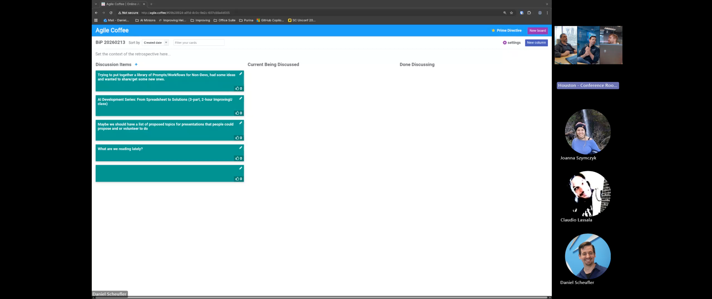
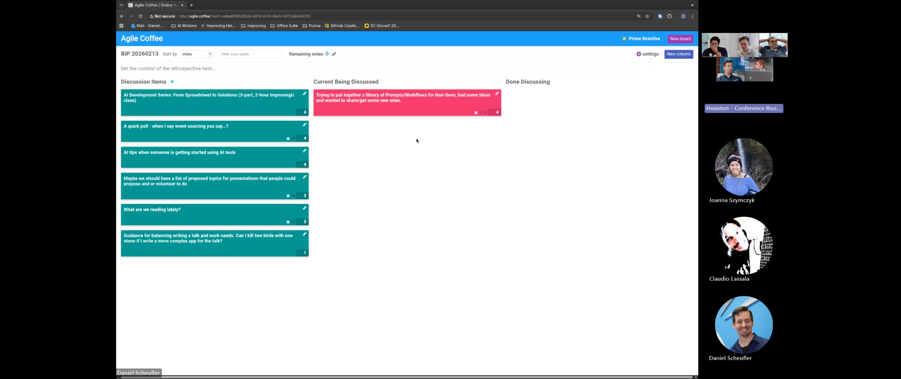
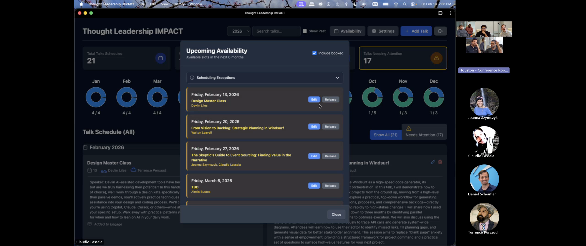
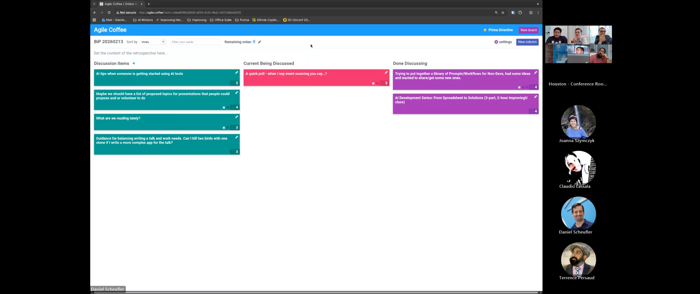

# BiP Session Summary — 2026-02-13

## Session Overview

- **Duration**: ~53 minutes
- **Facilitator**: Daniel (filling in for Matthew, who was absent)
- **Participants**: Daniel, Claudio, Joanna Szymczyk (remote), Jonathan, Terrence, Alexis

> **Note on attribution**: This was a hybrid meeting recorded in Microsoft Teams. Remote participants (Joanna) have clear speaker identification in the Teams transcript. In-person participants share a conference room microphone. A secondary Deepgram-diarized transcript was used to improve speaker identification. Daniel is confirmed as facilitator (addressed by name). Claudio is confirmed through direct address. Jonathan and Terrence are identified through Deepgram diarization cross-referenced with contextual evidence (direct address by name, topic ownership, and continuity with previous sessions). Deepgram detected five speakers but there were likely additional in-person participants; some brief contributions may not be attributed.

*Session opening: the agile.coffee board before voting, with participants visible in the Teams sidebar.*

---

## Topics Discussed

### 1. Prompt/Workflow Library for Non-Developers (Top Voted)

**Raised by**: Daniel (facilitator)

Daniel presented a project he's been working on: creating a library of reusable prompts and workflows aimed at non-developer Improvers. The motivation is that Improving has a mix of technical and non-technical roles — project managers, BAs, UX/UI designers, DevOps — and while some have access to AI tools like Figma's autogen or Copilot, most lack practical workflows for using AI beyond their tool-specific features. The goal isn't to solve every friction yet, but to demonstrate what's possible and give people starting points they can iterate on.

**Example 1 — Research workflow**: Daniel demoed a prompt he uses heavily. You invoke `/research` with a topic, and the AI: (1) captures an initial note in markdown, (2) brainstorms sub-topics and asks for feedback, (3) searches the internet for each topic, (4) captures bullet points, key quotes, and source URLs, and (5) produces a 1,000–2,000 word summary. He's found this especially useful when researching unfamiliar technologies (e.g., GitHub Actions). The key insight: the research creates rich context that improves future problem-solving.

**Example 2 — Wardley Map facilitation**: Daniel introduced Wardley maps — a strategic facilitation tool for identifying core capabilities, customer needs, and technological maturity. Most of the room had never heard of it — Claudio noted he had "no connections in my mind right now." Jonathan, however, had been re-reading Daniel's articles and wondered why Wardley maps hadn't appeared yet. Daniel's approach: he borrowed expertise from Jonathan to create a facilitation guide, then used his research workflow to produce an AI-driven step-by-step walkthrough. The idea is that anyone with a prompt and an AI agent could facilitate a Wardley mapping session without needing a specialist present.

**The underlying pattern**: Daniel articulated a theory about AI-compressible labor. Traditional research involves: find article → read → personal summary. That summary step is part of human encoding and learning. His reframing: let AI discover sources and summarize, then let the human do the encoding. "I have not removed the human need to learn... but I have compressed one of the key points of labor."

**Discussion**:

Claudio pushed back constructively, arguing that before building tools, you need to understand what you're solving for. What friction do non-developers actually experience? He recommended gathering a small group, having them talk through their processes out loud, and identifying where they spend the most time. "I have a hard time starting from the tooling part because I don't know what you're building over here. You may need a hammer. You may need a screwdriver."

This sparked a deeper exchange about the difference between what people *want* and what they *need*. Claudio shared a story about using AI to help comprehend stakeholder explanations he wasn't fully grasping — when he presented the AI-assisted understanding back to them, they said "Wow, you really understood our problem." His response: "Not exactly, but I have a buddy who did."

Daniel acknowledged the gap: he hasn't had enough contact with non-developers to catalog their specific frictions. His strategy is to show what's possible through demos so they'll come back with "well, what about...?" and drive the next iteration.

The group also discussed how this approach could help new Improvers ramp up — e.g., when assigned a new client, run a research workflow to learn the client's market, strategy, and headwinds before the first meeting.

**Key points:**
- AI is "a tool maker's tool" — its value is in making tools for everything you can imagine, not just doing a single task
- Reorganizing the steps of a workflow (not just automating them) is what unlocks AI-compressible work for non-developers
- Start by demonstrating possibility, then let users drive the specifics of what they need
- The human still does the encoding and decision-making; AI compresses the collection and summarization

---

### 2. AI Development Series — ImprovingU Class (Second Highest)

**Raised by**: Claudio

Claudio presented his plan for a three-part ImprovingU class, picking up work originally started with Tariq (who has since left). Each part is designed as a 2-hour hands-on session — explicitly not lecture-based.

**Part 1 — From Spreadsheets to Apps**: Attendees bring a spreadsheet they use for something (budget tracking, scheduling, reporting). The class turns it into an app using AI tools. Claudio showed his own example: a TLC scheduling app built from Ahmed's old spreadsheet for managing Tech Friday availability. "The first prototype took literally 10 minutes to build." The exercise explores multiple tools on the same problem (Google Gemini, AI Studio, Windsurf) to show different outputs from the same requirements.

*Claudio's TLC scheduling app: donut charts showing monthly availability, upcoming talk schedule with February 2026 sessions listed, and talk descriptions — all built from Ahmed's original spreadsheet.*

**Part 2 — From Need to Prototype**: Recruit people from leadership and other roles to play product owners with real problems. Small groups (2-3 people) work with a product owner to: identify personas, extract user stories, use diverge/converge design, prototype solutions using AI tools, and present options back. The emphasis is on capturing conversations (record, transcribe, feed to AI for user stories and personas).

**Part 3 — Sprint Review**: Groups prepare and deliver a sprint review of what they built. The first hour is prep, the second is presentations. Claudio emphasized this is a skill many consultants don't practice enough — "you spent two weeks working on this thing, producing a lot of code... and then you didn't do well with presenting at sprint review."

Joanna (remote) asked whether this is geared toward developers, non-developers, or both. Claudio was emphatic: everyone and anybody who shows up. "The main thing is, can you articulate what you perceive as a problem, can you extract the need out of it?" The tools aren't specific to code production.

Terrence connected this directly to an idea he'd raised a couple weeks prior about bridging the gap between developers and non-developers. He noted that non-developers can do everything Claudio described if we "realistically think about the idea of concise speaking language," and suggested making a specific outreach to non-developers to join. He also mentioned that Jeannie and Mike would be interested. Terrence and Jonathan had both recently taken a new AI class, where participants self-assessed at levels 1-3 on AI skills, with many still in the "I just kind of chat with AI and say yes or no" stage.

Claudio is targeting a March start, one part per week. He needs two assistants to help groups stay on track (he's counting on Alexis and Matthew).

**Key points:**
- Designed to be tool-agnostic — use three different AI tools on the same problem to compare outputs
- Deliberately includes non-developers as full participants, not just observers
- The flow mirrors real consulting work: understand the problem → prototype → present to stakeholders
- Sprint review practice is a gap many consultants don't address
- Claudio is coordinating with leadership, community engagement, and user group organizers for product owner volunteers

---

### 3. Event Sourcing — Audience Temperature Check (Carryover from Last Week)

**Raised by**: Joanna Szymczyk (remote)

Joanna is preparing a TLC talk on event sourcing, specifically addressing skepticism around it. She wanted a quick poll: when you hear "event sourcing," what comes to mind?

**Responses from the room:**
- "Accounting" — Daniel's mind immediately went to double-entry bookkeeping
- "An immutable data stream" — Jonathan described it as events that can be pulled off a queue or stored for playback, with "all kinds of fun DevOps-y things related to it"
- "Redux" and "CQRS" — Terrence's developer-to-developer frame of reference
- Several participants had never heard the term

Jonathan shared a story about a retail company that completely fell over and then brought themselves back up because they had implemented event sourcing throughout their entire infrastructure. The company was eventually bought by Walmart.

Daniel framed a key question for Joanna's talk: "Is it the right thing or is it the shiny hammer?" He loves event sourcing in concept but recognizes it's overkill for many use cases — "killing an ant with a bazooka." Terrence countered: "But if you're going to war, you need a bazooka."

Daniel kept probing to generate talk content: When do you transition to event sourcing? Do you have to start with it, or can you convert? Can you run a hybrid system?

Joanna revealed she's currently in the middle of converting a client to event sourcing — a 20,000-line PR. She noted the migration is dual-write (both old and new systems simultaneously), which made it "extra, extra, extra painful" but safer. The assessment started with AI assistance and a prototype in two days, but she underestimated the thorniness of the existing codebase's call graph, which required significant manual documentation work.

Claudio and Joanna have been collaborating on her talk prep — approximately three sessions so far. Joanna used NotebookLM to generate slides and is "really excited about the slides."

**Key points:**
- Range of familiarity in the room: from "never heard of it" to Jonathan's deep technical understanding and war stories
- The "shiny hammer" / overkill concern is the primary skepticism to address
- Joanna's real-world conversion story (hybrid migration, 20K line PR) gives her strong credibility for the talk
- Daniel encouraged Joanna to use the questions raised today as talk content
- Opening a talk with "when I say X, you say...?" was suggested as an effective technique

---

### 4. TLC Talk Proposal Process (Brief Discussion, End of Session)

**Raised by**: Daniel (facilitator), building on the previous discussion

The idea: create a visible list of proposed talk topics that people can either volunteer to present or request to hear about. Joanna expressed interest in co-presenting with someone else.

Claudio pointed to the existing TLC Teams channel under the Houston team as the right place for this — no new tooling needed. He's already posting weekly summaries (video link, discussion summary, sometimes infographics) every Monday. The plan is to add a call for topic proposals to his monthly schedule emails.

Daniel noted a supply/demand asymmetry: speakers would love to know what audiences want to hear, but that doesn't mean audiences will proactively declare their interests. Joanna volunteered to lead the charge by posting her ideas, both topics she'd present and topics she'd want to hear about.

**Key points:**
- Start with the existing TLC Teams channel rather than building new tools
- Speakers want to know audience demand; audiences may not proactively share it
- Monthly schedule emails will include a call for topic ideas
- "Solve that problem when we get there" — if there's a flood of proposals, that's a good problem to have

---

## Key Themes & Insights

1. **AI as tool maker, not just tool** — Daniel's framing that AI's primary value isn't in "go do a thing" (that's what tools are for) but in being able to make a tool for everything you can imagine. This reframes how non-developers should think about AI adoption.

2. **Reorganize the workflow, don't just automate it** — The research example showed that changing the order of steps (find → AI summarize → human encode) rather than just speeding up the old order (find → human read → human summarize) is what unlocks AI-compressible work.

3. **Wants vs. needs** — Multiple participants returned to the consulting fundamental: people tell you what they want, not what they need. AI can help unveil the actual need, even when humans are "failing to communicate" it.

4. **Inclusive by design** — Both major topics (prompt library and AI development series) explicitly targeted non-developers. The group is actively working to bridge the gap between technical and non-technical Improvers.

5. **Show, don't tell** — Claudio's spreadsheet-to-app demo, Daniel's research workflow demo, and Joanna's real-world event sourcing migration all followed the same pattern: concrete examples over abstract theory.

6. **The shiny hammer problem** — Event sourcing discussion surfaced a universal engineering tension: powerful tools that are overkill for simple problems. Knowing *when* to apply a pattern is as important as knowing *how*.

---

## Next Week's Potential Follow-ups

- Claudio's AI Development Series — scheduling and logistics for the March launch
- Joanna's event sourcing TLC talk preparation (using today's feedback to shape content)
- Daniel's prompt/workflow library — iteration based on non-developer feedback
- TLC topic proposal process — whether people actually post ideas to the channel
- Matthew's return and recap of what he missed

---

## Board State

**Board**: [agile.coffee](http://agile.coffee/#09b28924-a91d-4c0c-9e2c-607c88a4d005)

**Done Discussing:**
- "Trying to put together a library of Prompts/Workflows for Non-Devs, had some ideas and wanted to share/get some new ones." (4 votes)
- "AI Development Series: From Spreadsheet to Solutions (3-part, 2-hour ImprovingU class)" (4 votes)
- "Maybe we should have a list of proposed topics for presentations that people could propose and or volunteer to do" (4 votes)
- "A quick poll - when I say event sourcing you say...?" (5 votes)
- "AI tips when someone is getting started using AI tools" (5 votes) — folded into the broader AI development series and non-developer tools discussions

**Not Discussed:**
- "What are we reading lately?" (3 votes)
- "Guidance for balancing writing a talk and work needs: Can I kill two birds with one stone if I write a more complex app for the talk?" (3 votes)

---

## Session Notes

- Matthew Wright was absent; Daniel facilitated in his absence
- The session ended with a lighthearted reminder to "tell Matt how much you missed him"
- Claudio mentioned he'll share the recording and summary in the TLC channel as usual
