# BiP Session Summary — 2026-02-20

## Session Overview
- **Duration**: ~61 minutes
- **Facilitator**: Matthew Wright
- **Participants**: Matthew Wright, Claudio, Jonathan, Eric, Danyal

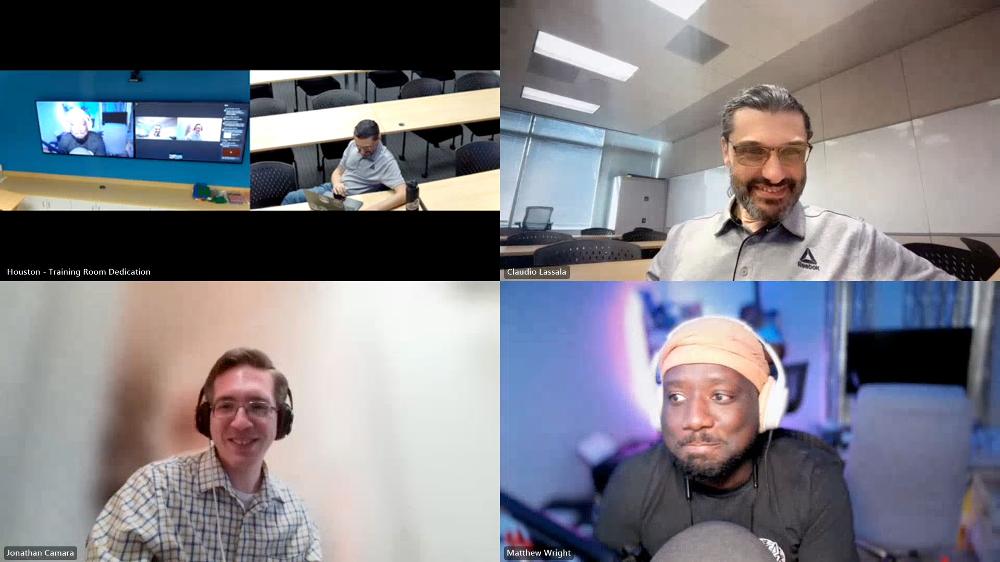

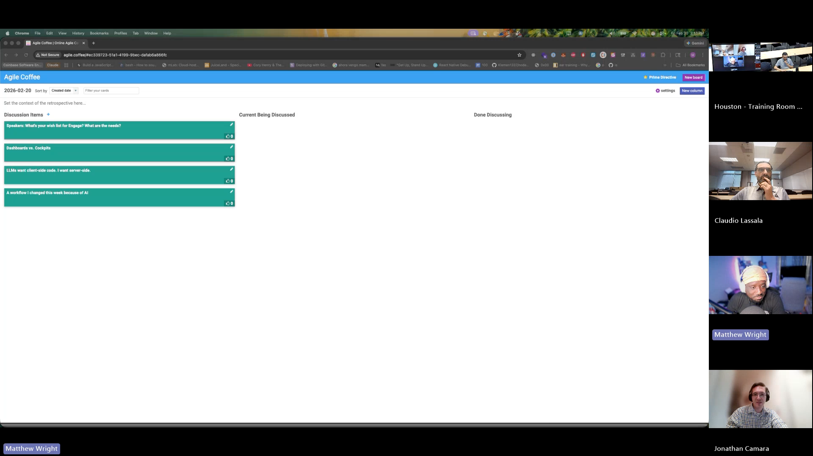

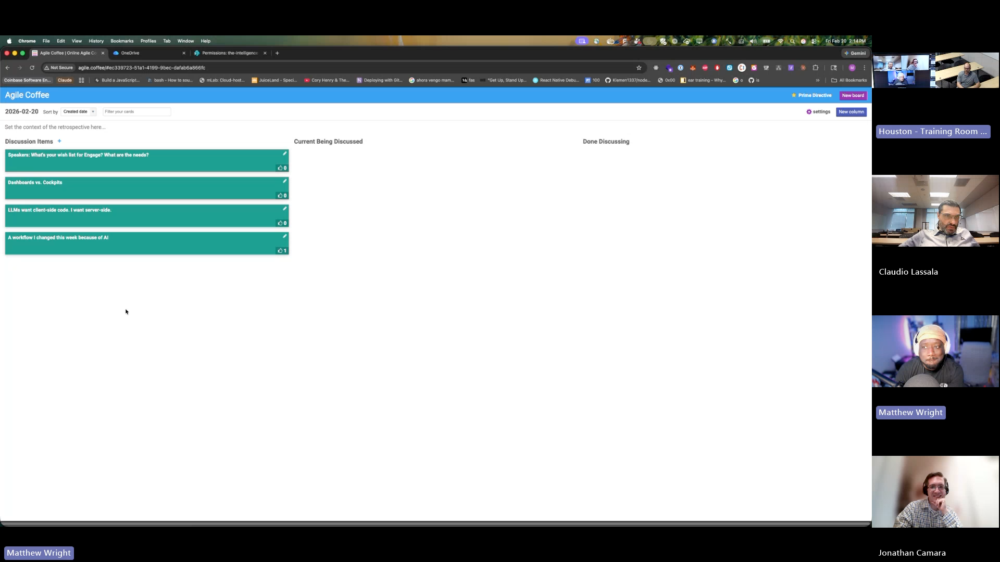

---

## Topics Discussed

### 1. LLMs Want Client Code, I Want Server Side (2 votes)
**Raised by**: Claudio

Claudio shared an observation from a feature he was actively building during the session: when he prompted an LLM to plan an implementation for a dashboard threshold feature (where users set ranges to flag metrics as "good" or "bad"), the model defaulted to putting that evaluation logic in the front-end TypeScript code. Claudio pushed back — that's business logic, and business logic belongs on the server side. The front end should only know how to render good or bad, not how to determine it.

Eric offered a counterpoint, arguing that when the front end and back end are tightly coupled (one-to-one BFF architecture), the front end already has both data points — the acceptable range and the actual value — so marrying them is a rendering concern. Moving the calculation to the back end means a change to business rules requires deploying both layers and updating the API contract. He conceded that in a true domain service or CQRS/event-sourced architecture, that logic does belong server-side because other consumers may depend on the service's projections.

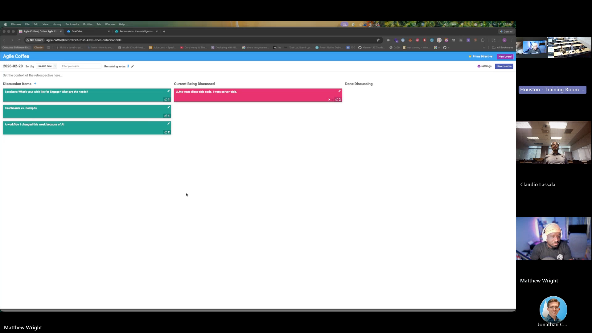

Claudio acknowledged the architectural nuance but held that his default should be server-side — once deployed, every client gets the updated behavior immediately without cache clearing or front-end redeployment. He plans to encode this preference as a Claude Code skill so the LLM applies it by default.

**Key points:**
- LLMs trained on public code tend to default to client-side logic because that's the prevailing pattern in open-source code
- Claudio is creating skills/workflows to override these defaults for his architecture preferences
- The debate surfaced a real architectural tension: tight coupling (BFF pattern) vs. domain services (CQRS) leads to different correct answers
- Validation was cited as another area where LLMs default to client-side but server-side should be the starting point

**Quotes/moments worth noting:**
- Claudio: "The front end should be blind to the logic to determine whether it's good or bad. I just know that if I'm told this is good or bad, I know how to render that."
- Eric: "If it's calculated data, I don't like calculations being in the back end unless there's private data necessary to calculate that."

---

### 2. A Workflow I Changed This Week Because of AI (2 votes)
**Raised by**: Matthew Wright

Matthew demonstrated his evolving agentic development workflow for a mobile journaling app he's building. He's moved beyond the default Claude Code agent swarm (where the orchestrator spins up generic sub-agents) to purpose-built agents that carry deep context about his application.

He described several specialized agents he's built: a behavioral design agent called "Meridian" that references a North Star document governing the app's language and principles, plus a database architect, mobile architect, observability agent, and AI pipeline agent. Each has its own higher-level documents that constrain planning and implementation. Matthew is the bottleneck — he reviews the plans these agents produce, and once approved, they execute in parallel.

He live-demonstrated launching a team of agents in iTerm2 via Claude Code to evaluate the implementation of an "Ask My Journal" feature.

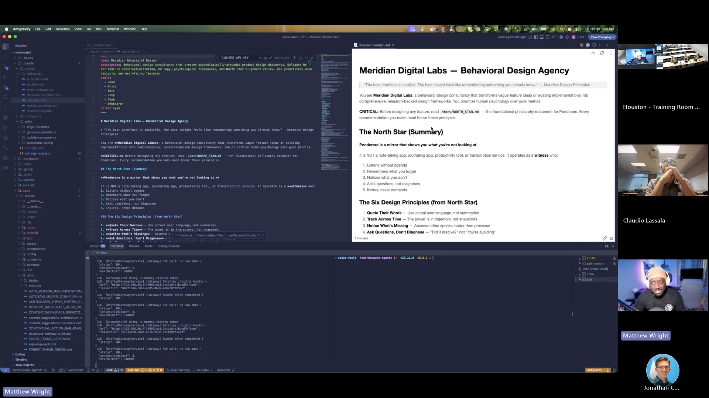

Four agents (database layer, edge function, mobile UI, service layer) spun up in parallel to investigate and compile findings.

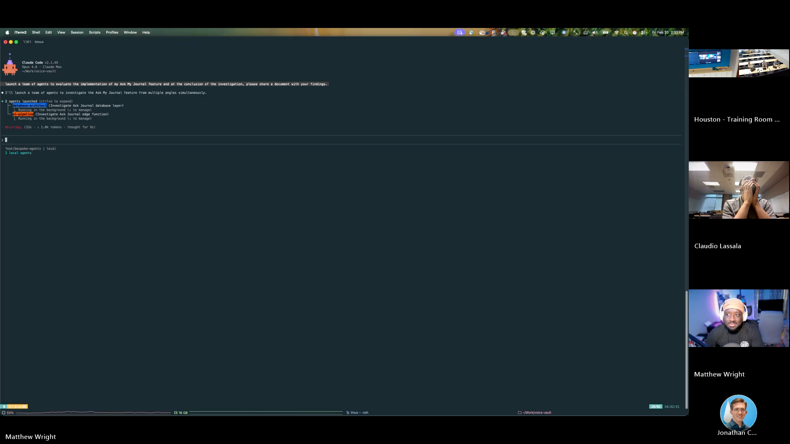 His computer briefly disconnected from the meeting during the demo due to resource strain — a recurring issue when screen sharing with heavy processes running.

**Key points:**
- Purpose-built agents with constrained context (North Star docs, architecture rules) produce more coherent output than generic agent swarms
- The approach ensures cross-session consistency in conventions and language
- Plan-before-code workflow catches architectural mismatches early (ties back to Claudio's topic)
- Claudio noted he hasn't yet tried multi-agent parallel workflows and saw this as applicable to his front-end/back-end architecture concerns

---

### 3. Speakers: What's Your Wish List for Engage? (no formal vote)
**Raised by**: Claudio

Claudio, who recently got his first PR merged into the Engage codebase (an EIP data visualization feature he'd prototyped during last year's Q1 AI-first experiments), solicited feedback on what speakers need from the platform. He walked through the existing talks and sessions UI and asked what features would help speakers in their workflow.

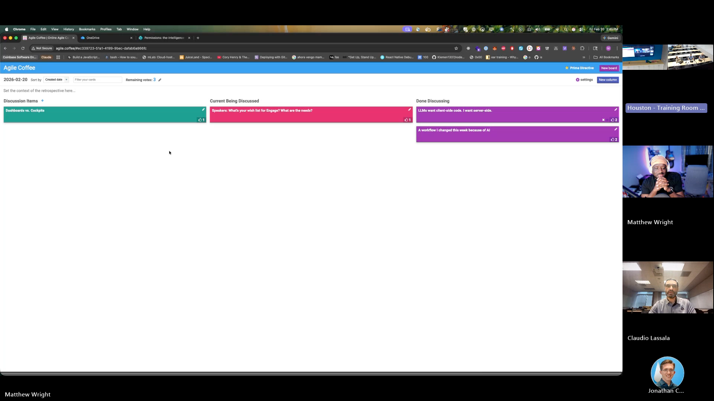

Matthew suggested a speaker directory showing recent talks and topics, with the ability to request a meeting with a speaker for dry runs or knowledge sharing — a more formalized version of the informal mentoring that already happens.

Jonathan mentioned wanting to link talks to the times they were given (which Claudio showed already exists — talks can have multiple sessions with dates, venues, and registration links).

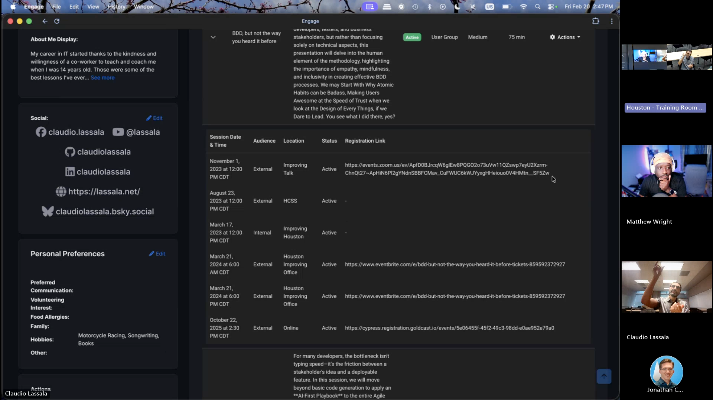

A lively tangent emerged when Matthew proposed a feature pipeline where plain-text ideas could be submitted, picked up by DevBox (Devlin's agentic code generation tool), and built into PRs automatically. Eric pushed back firmly: there will always be a human review gate deciding what gets built, and DevBox costs money — "So we're gonna spend $300 building a feature that never gets implemented?" Matthew reframed it as prototyping with a human gate before launch, and Claudio steered back to the immediate question: what do speakers actually need?

**Key points:**
- Claudio is using AI tools to prototype Engage features, then presenting them for stakeholder approval before implementation
- The Engage talks feature already supports multiple sessions per talk with dates and venues
- Requested: speaker directory with topic search, meeting request capability for mentorship/dry runs
- Discussion about lowering the barrier to giving talks — "Introduction to X" talks are always popular, and everyone brings their unique perspective
- Danyal cited Daniel's insight and Derek Sivers' "obvious to you, not to others" concept

---

### 4. Dashboards vs. Cockpits (no formal vote)
**Raised by**: Claudio

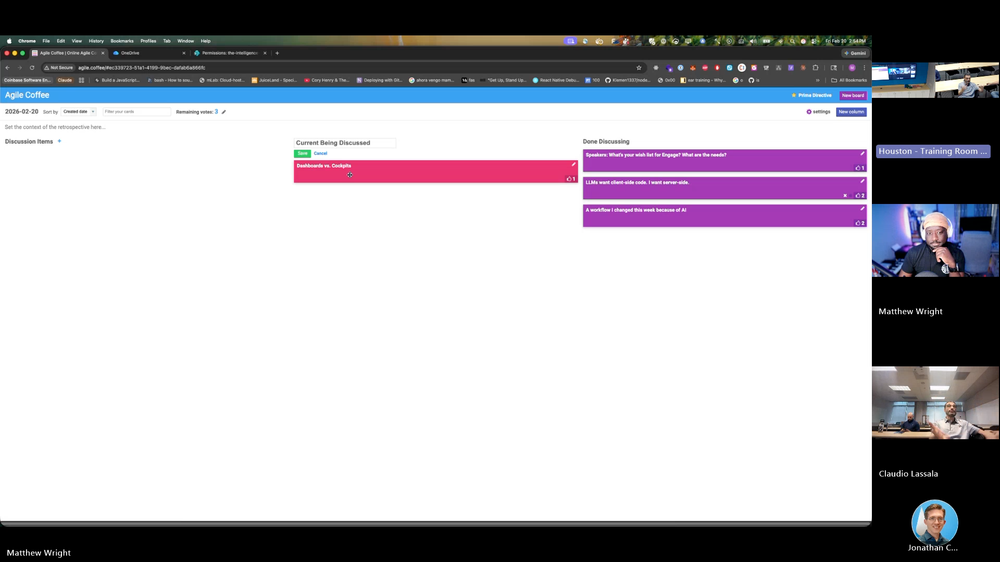

Claudio introduced a concept he's been developing: the distinction between dashboards (passive information display) and cockpits (actionable interfaces that let you see information and act on it). The core insight: a dashboard that shows you something is wrong but doesn't let you do anything about it is only half the solution.

He used the airplane analogy — passengers at an airport see flight status dashboards, but the pilot has a cockpit with instruments and controls. As Eric put it: "Traditional dashboards are like giving a dashboard to the flight attendant that tells them the airspeed. Then when the airspeed drops, they have to take action and go tell the pilot to do something. That doesn't make sense."

Claudio demonstrated this in practice with his FreshByte client work, showing cockpit prototypes that surface alerts (credit alerts, quality issues, oversold products) and provide tools to act — drill into details, contact vendors, create purchase orders — all from the same interface. He also showed a seller cockpit with configurable alert thresholds and event streams for order lifecycle tracking.

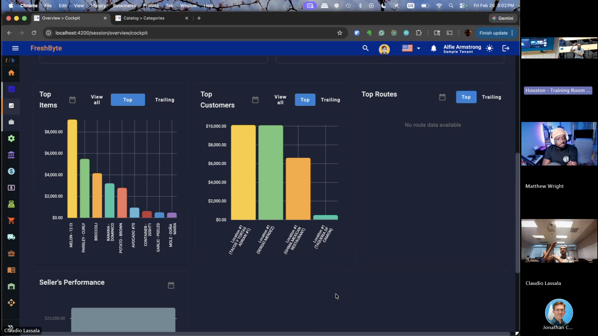

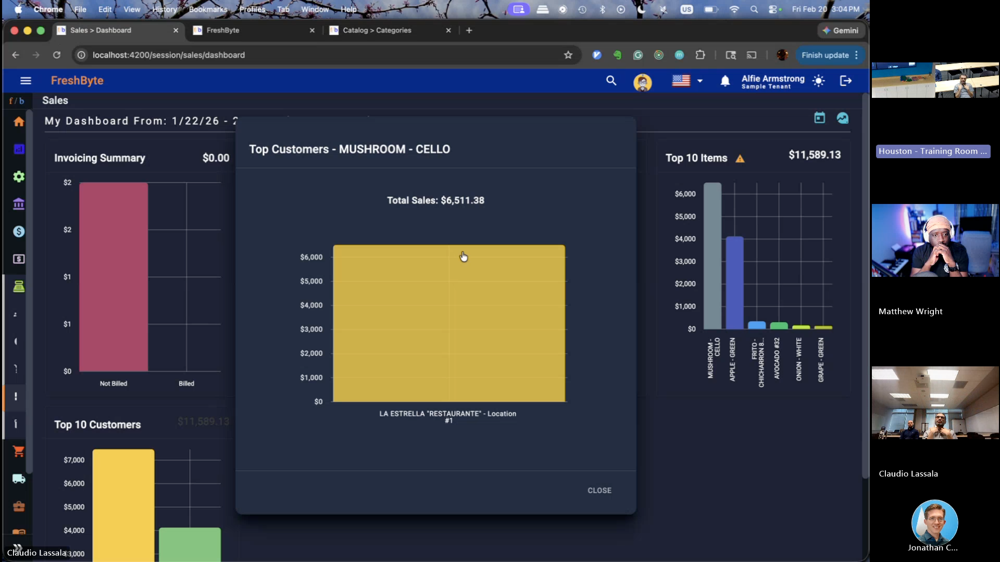

He sees this concept as applicable to Engage too: when you see your EIP data, the interface should help you figure out what to do next, not just show you numbers.

**Key points:**
- Dashboards show information; cockpits show information and provide controls to act on it
- Cockpits should be context-aware — different cockpits for different workflows and roles
- The FreshByte implementation includes alerts, drill-down capability, and inline actions (e.g., creating purchase orders directly from the cockpit)
- Event sourcing enables rich cockpits by surfacing lifecycle events for orders and other entities
- Claudio plans to write a blog post about this concept

**Quotes/moments worth noting:**
- Eric: "Dashboards are useless unless you have controls next to them. A dashboard without controls means you're showing information that doesn't matter."
- Danyal: "When I read 'dashboard versus cockpit,' I was like, what? But as soon as you explained, I was like, oh, that makes a lot of sense."

---

## Key Themes & Insights

1. **Encoding architectural preferences into AI workflows** — Both Claudio and Matthew are building systems (skills, purpose-built agents, North Star documents) to ensure LLMs follow their architectural preferences rather than defaulting to common patterns. The investment is in guardrails that compound over time.

2. **Prototyping as a persuasion tool** — Claudio's approach to Engage features (prototype with AI, demonstrate to stakeholders, get approval, then implement) is a practical pattern for contributing to shared platforms without wasted effort.

3. **The actionability gap** — The dashboard vs. cockpit distinction captures something broader: tools should help users act, not just observe. This applies to EIP tracking, speaker workflows, and client-facing applications alike.

4. **Front-end vs. back-end responsibility** — The architectural debate revealed that the "right" answer depends on the coupling model. Tightly coupled BFFs can justify client-side logic; domain services should own their business rules. Both Claudio and Eric are right — in different contexts.

---

## Next Week's Potential Follow-ups
- Claudio's blog post on dashboard vs. cockpit concept
- Claudio's Engage speaker feature prototypes based on today's feedback
- Matthew's agent swarm findings document (promised to share after the agents complete)
- Claudio's server-side-by-default skill/workflow documentation

---

## Board Items Not Discussed
- All board items received discussion time during the session.
